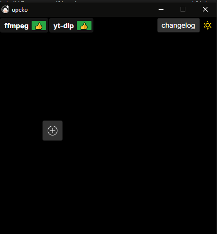
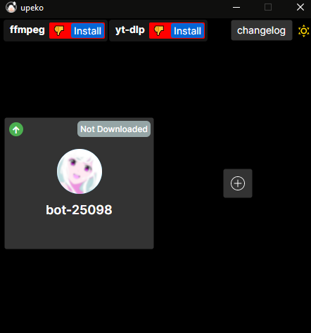
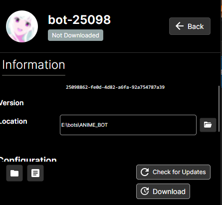
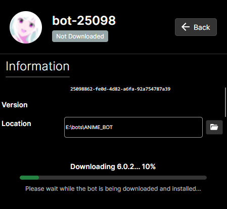
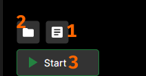

# Setting Up NadekoBot on Windows With the Updater

### Operating System Compatibility

- Windows 10 or later (64-bit)

---

??? note "Creating a Discord Bot & Getting Credentials"
    --8<-- "md/creds-guide.md"

---

## Setup

1. Download and run the [upeko][Updater].

    

2. Click the plus button to add a new bot

    

3. If you want to use the music module, click on **`Install`** next to `ffmpeg` and `yt-dlp` at the top
4. Click on the newly created bot

    

5. Click on **DOWNLOAD** at the lower right

    
    

6. When installation is finished, click on **CREDS** (1) above the **RUN** (3) button on the lower left
7. 2 simply opens your bot's data folder.
8. Paste in your BOT TOKEN previously obtained

## Starting the bot

- Either click on **`RUN`** button in the updater or run the bot via its desktop shortcut.

## Updating Nadeko

- Make sure Nadeko is closed and not running

    (Run `.die` in a connected server to make sure).

- Make sure you don't have `data` folder, bot folder, or any other bot file open in any program, as the updater will fail to replace your version
- Run `upeko` if not already running
- Click on your bot
- Click on **`Check for updates`**
- If updates are available, you will be able to click on the Update button
- Click `Update`
- Click `RUN` after it's done
